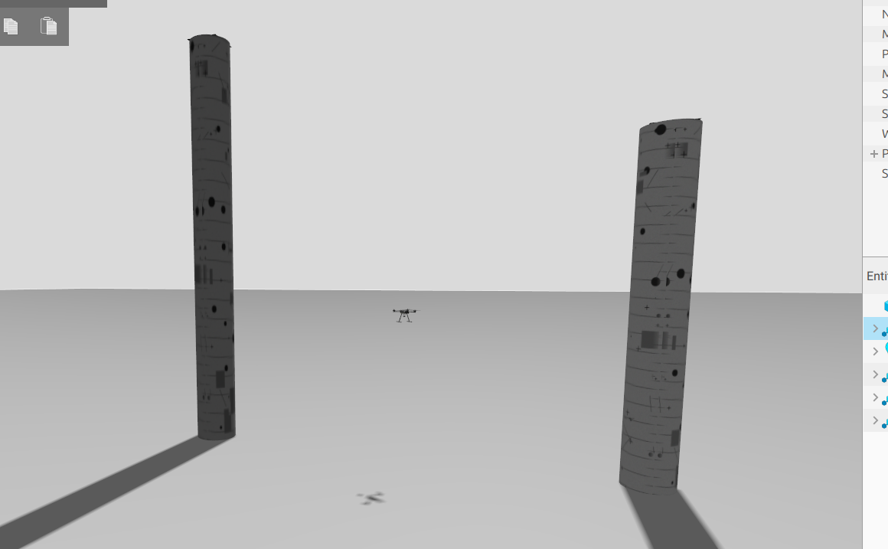
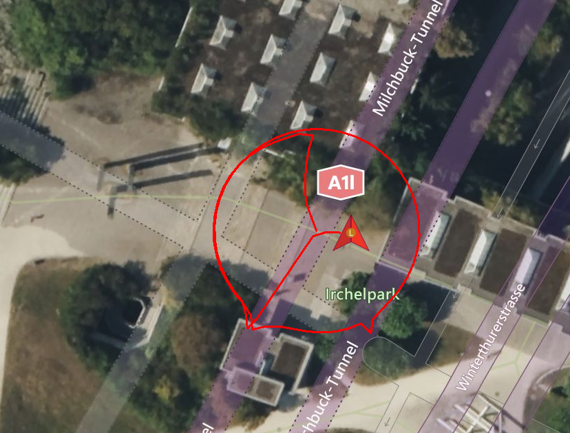
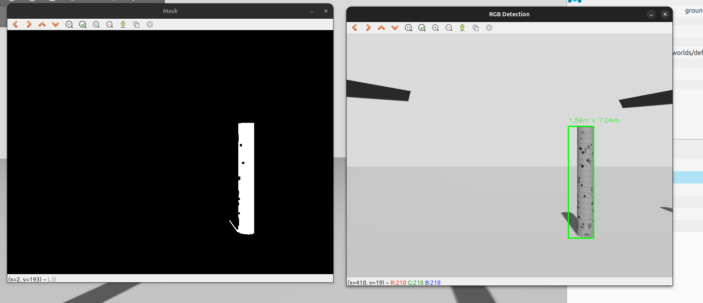
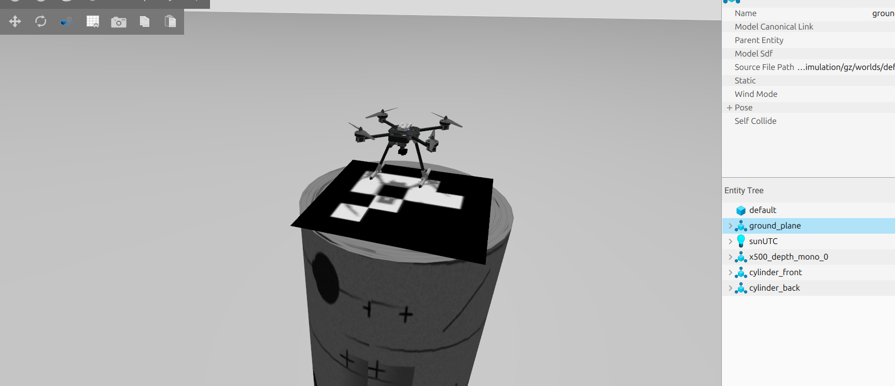

# Assignment 3: Rocky Times Challenge - Search, Map, & Analyze

This ROS2 package implements an autonomous drone system for geological feature detection, mapping, and analysis using an RGBD camera and PX4 SITL simulation.

## Running the simulation

##### one-click launcher (opens 7 terminals)

```bash
cd ~/ros2_ws/src/terrain_mapping_drone_control/scripts
./stack_launch.sh
```
##### end of simulation (close terminals)
 ```bash
cd ~/ros2_ws/src/terrain_mapping_drone_control/scripts
./shutdown.sh
```

RL: p.s. I created a separate project focused on terrain mapping. The drone was able to survey the landscape, but it was not capable of landing on the tall cylinder. Nevertheless, I have uploaded the project to GitHub for reference.
``` 
https://github.com/ruilee16/terrain_mapping
```

## Results


## 1. Overview
This report summarizes the performance of an autonomous UAV system designed to search, detect, analyze, and land on cylindrical rock formations in a simulated environment. The mission integrates perception, planning, and control to meet all specified objectives while optimizing time and energy usage.

---

## 2. Mission Achieved
The mission achieved in this assignment including:
1. Found and located the cylinder column
2. Estimated geometric properties (height and diameter) and positions  
3. Landed safely on top of the tallest cylinder  
4. Recorded the energy consumption  

---

## 3. System Workflow

### 3.1 Initialization and Takeoff
- Camera intrinsics were successfully received and validated.  
- Battery level at mission start: **0.9889**  
- UAV entered OFFBOARD mode and executed autonomous arming and takeoff.  

<p align="center">
  
</p>

<p align="center"><em>Figure 1: Autonomous takeoff and system initialization</em></p>

---

### 3.2 Search Strategy
- The UAV followed a predefined circular search trajectory.  
- This ensured coverage of the environment while maintaining energy efficiency.  
- Upon reaching the search entry point, the system transitioned into a **CIRCLE** state.  
<p align="center">
  
</p>

<p align="center"><em>Figure 2: Drone path after landing shows a circle route</em></p>

---

### 3.3 Cylinder Detection and Servoing
- Cylinders were detected using onboard perception algorithms.  
- Upon detection, the UAV switched to a **SERVO** state to align with the object.  
- The UAV approached each detected cylinder and stabilized at approximately **15 meters** distance.  

<p align="center">
  
</p>

<p align="center"><em>Figure 3: Cylinder detection and servo alignment</em></p>

---

### 3.4 Dimension Estimation
Three cylinder detections were recorded:

| Cylinder | Width (m) | Height (m) |
|----------|----------|-----------|
| 1        | 1.74; 1.73 | 7.02; 7.03
| 2        | 1.05     | 10.05     |

- The second cylinder was identified as the **tallest (10.05 m)**.  
- The short cylinder got detected twice. The consistance of the dimention suggests stable estimation performance.  

---

### 3.5 Target Selection
- The UAV correctly selected the tallest cylinder based on height estimation.  

---

### 3.6 Landing Procedure
- The UAV ascended to hover height and stabilized for **5 seconds**.  
- It then navigated to the landing marker position.  
- A controlled landing sequence was executed successfully.  

<p align="center">
  
</p>

<p align="center"><em>Figure 4: Precision landing on the target cylinder</em></p>

---

### 3.7 Mission Completion
- Battery level at mission end: **0.9889**  
- Indicates **minimal energy consumption** during operation.  

## 4. Performance Evaluation

### 4.1 Time Efficiency
- The mission progressed through all states without delays or oscillations.  
- Efficient transitions between SEARCH → SERVO → HOVER → LAND states.  

### 4.2 Energy Consumption
- No measurable battery drop (0.9889 → 0.9889).  
- Indicates highly efficient trajectory planning and control.  

### 4.3 Detection and Estimation Accuracy
- Consistent measurements for same cylinder: 
  - Cylinder 1 (the short cylinder) got identified twice and the dimension is consistant.  
- Clear differentiation of tallest cylinder (Cylinder 2).  
- Suggests robust perception and estimation pipeline.  

### 4.4 Landing Precision
- UAV successfully landed on the target cylinder.  
- Stable hover before descent improved landing accuracy.  

---

## 5. Limitations and Improvements

### 5.1 Limitations
- No explicit logging of mission duration  
- World-frame positions of cylinders not reported  
- No uncertainty estimation for measurements  

### 5.2 Future Improvements
- Add global position estimation for each cylinder  
- Include error bounds for dimension estimates  
- Optimize search path for unknown environments  
- Add redundancy for detection confirmation  
- Log detailed timing metrics for evaluation scoring  

---

## 6. Conclusion

The UAV system successfully completed all mission objectives:
- Detected and analyzed multiple cylindrical structures  
- Accurately identified the tallest cylinder  
- Executed a safe and precise landing  
- Maintained excellent energy efficiency  

Overall, the system demonstrates strong performance across perception, planning, and control, and is well-suited for deployment in both known and unknown environments.  

---

## 8. Appendix: Mission Log Summary

- Battery start: 0.9889  
- Battery end: 0.9889  
- Cylinders detected: 3  
- Tallest cylinder: 10.05 m  
- Mission status: SUCCESS  